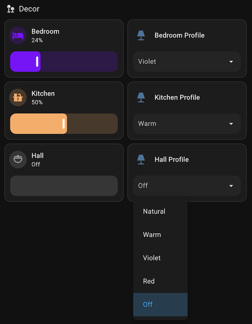
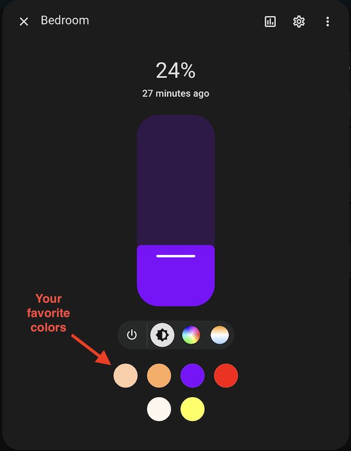

# Scenery: Better light profiles for Home Assistant

Scenery makes it easier to configure light profiles and favorite colors for all of your lights in Home Assistant so your lights turn on in your preferred state and the dashboard shows your preferred colors in the more-info dialog.

  - Define light profiles in YAML to preset the color and brightness of each light and set the default turn-on behavior with more color formats than [light_profiles.csv](https://www.home-assistant.io/integrations/light/#default-turn-on-values) supports.
  - Define favorite colors for your lights all in one place in YAML instead of configuring each light's favorite colors one at a time in the more-info dialog.
  - Make profile select entities to control and observe each light's currently active profile as if it were a stateful scene.  Use select actions to cycle through light profiles at the push of a button.

## Quick start

### Configuration example

Here's an example that you could add to your `configuration.yaml`.

This example does several things:

- It sets up the Scenery integration.
- It defines [light profiles](#light-profile-element) with a variety of colors and brightness levels.
- It configures [lights](#light-configuration-element) with some light profiles.  The first profile in the list determines the light's default turn-on color, brightness, and transition behavior.
- It replaces the favorite colors offered by the more-info dialog color picker for each light to include the colors of the associated light profiles plus some additional [favorite colors](#favorite-colors-element).  **Caution: All previously saved favorite colors for those lights will be deleted!**
- It creates a [profile select entity](#profile-select-element) for each light to control and observe which light profile is active.  Try adding the select entity to your dashboard to make it easier to change your lighting ambiance or use it to build [automations](#actions)!

Read the [configuration details](#configuration-details) for more information.

```yaml
# Configure the scenery integration
scenery:
  profiles:
    - name: Natural
      color_temp_kelvin: 4000
      brightness: 255
      transition: 0.5
    - name: Warm
      color_temp_kelvin: 2800
      brightness: 128
      transition: 0.5
    - name: Violet
      hs_color: [270, 100]
      brightness: 60
      transition: 0.5
    - name: Red
      hs_color: [0, 100]
      brightness: 30
      transition: 0.5
  lights:
    - entity_id:  # Change these entity IDs for your lights
        - light.bedroom
        - light.kitchen
        - light.hall
      profiles: [Natural, Warm, Violet, Red]
      profile_select:
      favorite_colors:
        - color_temp_kelvin: 6000
        - hs_color: [60, 70]
```

### Dashboard example

#### Profile select entities

Use profile select entities in your dashboard to control and observe the active light profile for each of your lights as illustrated here with [tile](https://www.home-assistant.io/dashboards/tile/) cards.

When you select an option from the dropdown, the light changes brightness and color as you defined in the corresponding light profile.  And when you change the light's brightness and color, the selected option changes to the closest matching light profile.  The selected option changes to *Off* when you turn the light off.  And if there is no close match then no option is selected.

You can also use profile select entities for automations!



<details>
<summary>YAML</summary>

```yaml
type: grid
cards:
  - type: heading
    heading: Decor
    heading_style: title
    icon: mdi:lamps
  - features:
      - type: light-brightness
    type: tile
    entity: light.bedroom
    features_position: bottom
    vertical: false
    icon: mdi:bed
  - features:
      - type: select-options
    type: tile
    features_position: bottom
    vertical: false
    entity: select.bedroom_profile
  - features:
      - type: light-brightness
    type: tile
    entity: light.kitchen
    features_position: bottom
    vertical: false
    icon: mdi:countertop
  - features:
      - type: select-options
    type: tile
    features_position: bottom
    vertical: false
    entity: select.kitchen_profile
  - features:
      - type: light-brightness
    type: tile
    entity: light.hall
    features_position: bottom
    vertical: false
    icon: mdi:dome-light
  - features:
      - type: select-options
    type: tile
    features_position: bottom
    vertical: false
    entity: select.hall_profile
```
</details>

#### Favorite colors in the more-info dialog

The more-info dialog shows your favorite colors from the `profiles` and `favorite_colors` configuration elements.



## Configuration details

### Scenery element

Add the `scenery` element to your `configuration.yaml` to set up the Scenery integration.

| Attribute | Optional | Description |
| --------- | -------- |------------ |
| profiles  | yes      | List of light profile elements. |
| lights    | yes      | List of light configuration elements. |

```yaml
# Configure the scenery integration
scenery:
  profiles:
    - ...
  lights:
    - ...
```

### Light profile element

Each element of the `profiles` list defines a light profile.  A light profile has a unique name and a set of lighting attributes such as a color, brightness, and transition.

The list of profiles defined here serves a similar purpose to the [light_profiles.csv](https://www.home-assistant.io/integrations/light/#default-turn-on-values) file but it supports more color formats and the default turn-on profiles are configured in the `lights` element.

| Attribute         | Optional | Description |
| ----------------- | -------- |------------ |
| name              | no       | The name of the profile. Must be unique. |
| brightness        | yes      | The default brightness as an integer from 0 to 255. |
| transition        | yes      | The default transition duration in seconds as a float. |
| color_temp_kelvin | yes      | Color temperature in kelvin as an integer. |
| hs_color          | yes      | HS color as a list of 2 floats (hue, saturation), hue is scaled 0 to 360, saturation is scaled 0 to 100. |
| rgb_color         | yes      | RGB color as a list of 3 integers (red, green, blue) from 0 to 255. |
| rgbw_color        | yes      | RGBW color as a list of 4 integers (red, green, blue, white) from 0 to 255. |
| rgbww_color       | yes      | RGBWW color as a list of 5 integers (red, green, blue, cold white, warm white) from 0 to 255. |
| xy_color          | yes      | XY color as a list of 2 floats (x, y). This format cannot be represented as a favorite color. |
| white             | yes      | White color as an integer from 0 to 255. This format cannot be represented as a favorite color. |
| color_name        | yes      | A human-readable string of a color name, such as `blue` or `goldenrod`. All [CSS3 color names](https://www.w3.org/TR/css-color-3/#svg-color) are supported. This format cannot be represented as a favorite color. |

```yaml
  # Define some light profiles
  profiles:
    - name: Natural
      color_temp_kelvin: 4000
      brightness: 255
      transition: 0.5
    - name: Warm
      rgbw_color: [255, 195, 66, 255]
      brightness: 200
    - name: Red
      hs_color: [0, 100]
```

### Light configuration element

Each element of the `lights` list defines a light configuration.  A light configuration associates light profiles and favorite colors with a light.

The `light.turn_on` action applies the color, brightness, and transition attributes of the light's default profile by default unless overridden by the action's parameters.  The `light.turn_off` action applies the transition attribute of the light's default profile by default unless overridden by the action's parameters.

Scenery configures the favorite colors that are shown in the light's more-info dialog to make it easier for users to pick relevant colors from the color attributes of each profile listed in `profiles` and additional `favorite_colors`.  **Caution: All previously saved favorite colors for those lights will be deleted!**

| Attribute         | Optional | Description |
| ----------------- | -------- |------------ |
| entity_id         | no       | A entity ID or a list of entity IDs for the lights to be configured by this element. |
| profiles          | yes      | A list of light profile names.  The first entry in the list sets the default profile for the specified lights.  If the list of profiles is empty or absent, then the light does not have a default profile. |
| favorite_colors   | yes      | A list of additional favorite colors to include in the light's more-info dialog. |
| profile_select    | yes      | When specified, creates a select entity for each light to select the light's active profile. |

```yaml
  # Define some light profiles
  lights:
    - entity_id: light.my_light_1
      profiles: [Natural, Warm]
    - entity_id: [light.my_light_2, light.my_light_3]
      profiles: [Warm, Red]
      favorite_colors:
        - ...
      profile_select:
```

### Favorite colors element

Adds a favorite color to the light's more-info dialog.  The frontend only supports a subset of all color formats as shown below.

| Attribute         | Optional | Description |
| ----------------- | -------- |------------ |
| color_temp_kelvin | yes      | Color temperature in kelvin as an integer. |
| hs_color          | yes      | HS color as a list of 2 floats (hue, saturation), hue is scaled 0 to 360, saturation is scaled 0 to 100. |
| rgb_color         | yes      | RGB color as a list of 3 integers (red, green, blue) from 0 to 255. |
| rgbw_color        | yes      | RGBW color as a list of 4 integers (red, green, blue, white) from 0 to 255. |
| rgbww_color       | yes      | RGBWW color as a list of 5 integers (red, green, blue, cold white, warm white) from 0 to 255. |

```yaml
  # A selection of favorite colors
  favorite_colors:
    - color_temp_kelvin: 4000
    - hs_color: [300, 70]
    - rgb_color: [255, 100, 100]
    - rgbw_color: [255, 100, 100, 50]
    - rgbww_color: [255, 100, 100, 50, 70]
```

### Profile select element

Creates a [select entity](https://www.home-assistant.io/integrations/select/) to control and observe a light's currently active profile as if it were a stateful scene.

The options of the select entity are the light's profiles (listed in the order in which they appear in the light configuration element) followed by an option to turn the light off.  The off option is labeled "Off" by default and it can be omitted altogether by setting `off_option` to an empty string.

Selecting an option other than off turns the light on with the corresponding profile applied to it.  Selecting the off option turns the light off.

As the state of the light changes, the selected option changes to the profile which most closely matches the new state of the light.  If there is no close match available, then no option is selected.

| Attribute         | Optional | Description |
| ----------------- | -------- |------------ |
| off_option        | yes      | The label for the off option. Defaults to "Off". Use an empty string to omit the off option altogether. |

```yaml
  profile_select:
    off_option: Off
```

The select entity derives its default entity ID from the entity ID of the light by removing the prefix `light.` and adding the suffix `_profile`.  Similarly, it derives its default name by appending the suffix *Profile*.  You can change entity's ID and name in the Home Assistant UI.

For example, the select entity for `light.my_light` whose name is *My Light* is assigned the default entity ID `select.my_light_profile` and the default name *My Light Profile*.

## Actions

### light.turn_on

To apply a light profile to a light, use the [`light.turn_on` action](https://www.home-assistant.io/integrations/light/#action-lightturn_on) and specify the name of the profile.

```yaml
action: light.turn_on
data:
  entity_id: light.my_light
  profile: My Profile
```

If the action also specifies color, brightness, or transition attributes, then the corresponding attributes of the profile will be overridden by the values of the action, as in the following example.

```yaml
action: light.turn_on
data:
  entity_id: light.my_light
  profile: My Profile
  brightness: 40  # Overrides the brightness specified by the profile, if any
```

### select.*

Use the [select actions](https://www.home-assistant.io/integrations/select/) of a [profile select entity](#profile-select-element) to control and observe a light's currently active profile as if it were a stateful scene.

Tip: You can make a button automation that cycles through light profiles in sequence with the `select.select_next` and `select.select_previous` actions.  Similarly, you can turn the light on to its default profile using `select.select_first` or turn it off with `select.select_last`.

### scenery.get_favorite_colors

Gets the favorite colors of a light.

#### Request

```yaml
action: scenery.get_favorite_colors
data:
  entity_id: light.my_light
```

#### Response

If the entity's favorite colors have been set, returns a list of them.

```yaml
favorite_colors:
  - color_temp_kelvin: 4000
  - hs_color:
      - 300
      - 70
  - rgb_color:
      - 255
      - 100
      - 100
  - rgbw_color:
      - 255
      - 100
      - 100
      - 50
  - rgbww_color:
      - 255
      - 100
      - 100
      - 50
      - 70
```

If the entity's favorite colors have not been set, returns null.  In this case, the front-end generates default colors to show in the more-info dialog and it does not store them for the entity unless they are modified by the user.

```yaml
favorite_colors: null
```

If the entity's favorite colors have all been removed, returns an empty list.  In this case, the front-end will not show any favorite colors in the more-info dialog; it will not generate default colors as in the previous case.

```yaml
favorite_colors: []
```

### scenery.set_favorite_colors

Sets the favorite colors of a light.

```yaml
action: scenery.set_favorite_colors
data:
  entity_id: light.my_light
  favorite_colors:
    - color_temp_kelvin: 4000
    - hs_color: [300, 70]
    - rgb_color: [255, 100, 100]
    - rgbw_color: [255, 100, 100, 50]
    - rgbww_color: [255, 100, 100, 50, 70]
```

Omitting the `favorite_colors` attribute reverts the entity's favorite colors to the default.  In this case, the front-end generates default colors to show in the more-info dialog and it does not store them for the entity unless they are modified by the user.

```yaml
action: scenery.set_favorite_colors
data:
  entity_id: light.my_light
```

Setting the `favorite_colors` attribute to an empty list removes all of the favorite colors.  In this case, the front-end will not show any favorite colors in the more-info dialog; it will not generate default colors as in the previous case.

```yaml
action: scenery.set_favorite_colors
data:
  entity_id: light.my_light
  favorite_colors: []
```

Tip: You can also set the favorite colors of a light with the [light configuration element](#light-configuration-element).

## Installation

### Manual

1. Clone the repository to your machine and copy the contents of custom_components/ to your config directory.
2. [Configure the integration](#configuration).
3. Restart Home Assistant.

### HACS

1. Add the integration through this link:
   [](https://my.home-assistant.io/redirect/hacs_repository/?owner=j9brown&repository=scenery&category=integration)
2. [Configure the integration](#configuration).
2. Restart Home Assistant.
