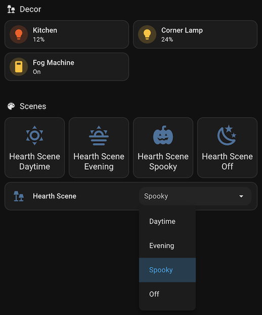

# Scenery: Better light profiles, favorite colors, and scenes for Home Assistant

Scenery helps you configure light profiles, favorite colors, and scenes for all of your lights in Home Assistant.

  - Define light profiles in YAML to preset the color and brightness of each light and set the default turn-on behavior with more color formats than [light_profiles.csv](https://www.home-assistant.io/integrations/light/#default-turn-on-values) supports.
  - Define favorite colors for your lights all in one place in YAML instead of configuring each light's favorite colors one at a time in the more-info dialog.
  - Make profile select entities to apply light profiles to lights and keep track of which light profiles are active.
  - Make scene select entities to apply predefined states to lights and other entities and keep track of which scenes are active.
  - Use select actions to cycle through light profiles and scenes at the push of a button.

## Quick start

### Configuration example

Here's an example that you could add to your `configuration.yaml`.

This example does several things:

  - The [`scenery` element](#scenery-element) sets up the Scenery integration.
  - The [`profiles` element](#profiles-element) defines light profiles for each light with a variety of colors and brightness levels.
  - The [`lights` element](#lights-element) associates light profiles and favorite colors with each light.
    - The first profile in the [`profiles` element](#profiles-element) determines the light's default turn-on color, brightness, and transition behavior.
    - The [`profile_select` element](#profile-select-element) creates a select entity for each light with options for each profile in the list including an option to turn the light off.  The currently selected option updates as the state of the light changes.
    - The favorite color picker in each light's more-info dialog is populated with with the colors of each profile in the list and the [`favorite_colors` element](#favorite-colors-element).  **Caution: All previously saved favorite colors for these lights will be deleted!**
  - The [`scene_select` element](#scene-select-element) defines several scenes to control a few lights in a coordinated manner and creates a select entity to apply a scene.  The currently selected option updates as the state of the entities in the scene changes.

Read the [configuration details](#configuration-details) for more information.

And try adding select entities to your dashboard to make it easier to change your lighting ambiance or use them to build [automations](#actions)!

```yaml
# Configure the scenery integration
scenery:
  profiles:
    - name: Natural
      color_temp_kelvin: 4000
      brightness: 255
      transition: 0.5
    - name: Warm
      color_temp_kelvin: 2800
      brightness: 128
      transition: 0.5
    - name: Violet
      hs_color: [270, 100]
      brightness: 60
      transition: 0.5
    - name: Red
      hs_color: [0, 100]
      brightness: 30
      transition: 0.5
  lights:
    - entity_id:  # Change these entity IDs for your lights
        - light.bedroom
        - light.kitchen
        - light.hall
      profiles: [Natural, Warm, Violet, Red]
      profile_select:
        off_option: "Off"
      favorite_colors:
        - color_temp_kelvin: 6000
        - hs_color: [60, 70]
  scene_select:
    - name: Hearth Scene
      unique_id: hearth_scene_select
      scenes:
        - name: Daytime
          entities:
            light.kitchen:
              state: on
              profile: Natural
            light.corner_lamp: off
            switch.fog_machine: off
        - name: Evening
          entities:
            light.kitchen:
              state: on
              profile: Warm
            light.corner_lamp:
              state: on
              brightness: 120
            switch.fog_machine: off
        - name: Spooky
          entities:
            light.kitchen:
              state: on
              hs_color: [20, 100]
              brightness: 30
            light.corner_lamp:
              state: on
              brightness: 60
            switch.fog_machine: on
        - name: "Off"
          entities:
            light.kitchen: off
            light.corner_lamp: off
            switch.fog_machine: off
```

### Dashboard example

#### Profile select entities

Use profile select entities in your dashboard to control and observe the active light profile for each of your lights as illustrated here with [tile](https://www.home-assistant.io/dashboards/tile/) cards.

When you select an option from the dropdown, the light changes brightness and color as you defined in the corresponding light profile.  And when you change the light's brightness and color, the selected option changes to the closest matching light profile.  The selected option changes to *Off* when you turn the light off.  And if there is no close match then no option is selected.

You can also use profile select entities for automations!


<details>
<summary>YAML</summary>

```yaml
type: grid
cards:
  - type: heading
    heading: Decor
    heading_style: title
    icon: mdi:lamps
  - features:
      - type: light-brightness
    type: tile
    entity: light.bedroom
    features_position: bottom
    vertical: false
    icon: mdi:bed
  - features:
      - type: select-options
    type: tile
    features_position: bottom
    vertical: false
    entity: select.bedroom_profile
  - features:
      - type: light-brightness
    type: tile
    entity: light.kitchen
    features_position: bottom
    vertical: false
    icon: mdi:countertop
  - features:
      - type: select-options
    type: tile
    features_position: bottom
    vertical: false
    entity: select.kitchen_profile
  - features:
      - type: light-brightness
    type: tile
    entity: light.hall
    features_position: bottom
    vertical: false
    icon: mdi:dome-light
  - features:
      - type: select-options
    type: tile
    features_position: bottom
    vertical: false
    entity: select.hall_profile
```
</details>

#### Scene select entities

Use scene select entities in your dashboard to activate scenes as illustrated here with [tile](https://www.home-assistant.io/dashboards/tile/) cards.

In this example, the scene controls two lights and a fog machine.  When you select an option from the dropdown, the entities in the scene change state according to the scene configuration.  When you change the state of the entities in the scene, the selected option changes to the closest maching scene.  And if there is no close match then no option is selected.

You can also use scene select entities for automations!



<details>
<summary>YAML</summary>

```yaml
type: grid
cards:
  - type: heading
    icon: mdi:lamps
    heading: Decor
    heading_style: title
  - type: tile
    features_position: bottom
    vertical: false
    entity: light.kitchen
  - type: tile
    features_position: bottom
    vertical: false
    entity: light.corner_lamp
  - type: tile
    features_position: bottom
    vertical: false
    entity: switch.fog_machine
  - type: heading
    heading: Scenes
    heading_style: title
    icon: mdi:palette
  - type: tile
    features_position: inline
    vertical: false
    entity: select.hearth_scene
    features:
      - type: select-options
```
</details>

#### Favorite colors in the more-info dialog

The more-info dialog shows your favorite colors from the `profiles` and `favorite_colors` configuration elements.


## Configuration elements

### Scenery element

Add the `scenery` element to your `configuration.yaml` to set up the Scenery integration.

| Attribute    | Optional | Description |
| ------------ | -------- |------------ |
| [profiles](#profiles-element) | yes      | List of profile elements. |
| [lights](#lights-element) | yes      | List of light elements. |
| [scene_select](#scene-select-element) | yes      | List of scene select elements. |

```yaml
# Configure the scenery integration
scenery:
  profiles:
    - ...
  lights:
    - ...
  scene_select:
    - ...
```

### Profiles element

Each element of the `profiles` list defines a light profile.  A light profile has a unique name and a set of lighting attributes such as a color, brightness, and transition.

The list of profiles defined here serves a similar purpose to the [light_profiles.csv](https://www.home-assistant.io/integrations/light/#default-turn-on-values) file but it supports more color formats and the default turn-on profiles are configured in the `lights` element.

*Note: Some light profile color formats cannot be represented as favorite colors so they will be omitted from the list of favorite colors shown in the more-info dialog.*

| Attribute         | Optional | Description |
| ----------------- | -------- |------------ |
| name              | no       | The name of the profile. Must be unique. |
| brightness        | yes      | The default brightness as an integer from 0 to 255. |
| transition        | yes      | The default transition duration in seconds as a float. |
| color_temp_kelvin | yes      | Color temperature in kelvin as an integer. |
| hs_color          | yes      | HS color as a list of 2 floats (hue, saturation), hue is scaled 0 to 360, saturation is scaled 0 to 100. |
| rgb_color         | yes      | RGB color as a list of 3 integers (red, green, blue) from 0 to 255. |
| rgbw_color        | yes      | RGBW color as a list of 4 integers (red, green, blue, white) from 0 to 255. |
| rgbww_color       | yes      | RGBWW color as a list of 5 integers (red, green, blue, cold white, warm white) from 0 to 255. |
| xy_color          | yes      | XY color as a list of 2 floats (x, y). This format cannot be represented as a favorite color. |
| white             | yes      | White color as an integer from 0 to 255. This format cannot be represented as a favorite color. |
| color_name        | yes      | A human-readable string of a color name, such as `blue` or `goldenrod`. All [CSS3 color names](https://www.w3.org/TR/css-color-3/#svg-color) are supported. This format cannot be represented as a favorite color. |

```yaml
  # Define some light profiles
  profiles:
    - name: Natural
      color_temp_kelvin: 4000
      brightness: 255
      transition: 0.5
    - name: Warm
      rgbw_color: [255, 195, 66, 255]
      brightness: 200
    - name: Red
      hs_color: [0, 100]
```

### Lights element

Each element of the `lights` list associates light profiles and favorite colors with a light.

The `light.turn_on` action applies the color, brightness, and transition attributes of the light's default profile by default unless overridden by the action's parameters.  The `light.turn_off` action applies the transition attribute of the light's default profile by default unless overridden by the action's parameters.

Scenery configures the favorite colors that are shown in the light's more-info dialog to make it easier for users to pick relevant colors from the color attributes of each profile listed in `profiles` and additional `favorite_colors`.  **Caution: All previously saved favorite colors for these lights will be deleted!**

| Attribute         | Optional | Description |
| ----------------- | -------- |------------ |
| entity_id         | no       | A entity ID or a list of entity IDs for the lights to be configured by this element. |
| profiles          | yes      | A list of light profile names.  The first entry in the list sets the default profile for the specified lights.  If the list of profiles is empty or absent, then the light does not have a default profile. |
| [profile_select](#profile-select-element) | yes      | When specified, creates a select entity for each light to select the light's active profile. |
| [favorite_colors](#favorite-colors-element) | yes      | A list of additional favorite colors to include in the light's more-info dialog. |

```yaml
  # Define some light profiles
  lights:
    - entity_id: light.my_light_1
      profiles: [Natural, Warm]
    - entity_id: [light.my_light_2, light.my_light_3]
      profiles: [Warm, Red]
      profile_select:
      favorite_colors:
        - ...
```

### Profile select element

The `profile_select` element within a [`lights element`](#lights-element) creates a [select entity](https://www.home-assistant.io/integrations/select/) to control and observe a light's currently active profile.

The options of the profile select entity are the names of the light's profiles (listed in the order in which they appear in the light configuration element) followed by an option to turn the light off.  The off option is labeled "Off" by default and it can be omitted altogether by setting `off_option` to an empty string.

Selecting an option other than off turns the light on with the corresponding profile applied to it.  Selecting the off option turns the light off.

As the state of the light changes, the selected option updates to the profile which most closely matches the new state of the light.  If there is no close match available, then no option is selected.  The profile select entity becomes unavailable whenever its light entity is unavailable.

The select entity derives its default entity ID from the entity ID of the light by removing the prefix `light.` and adding the suffix `_profile`.  Similarly, it derives its default name by appending the suffix *Profile*.  You can change entity's ID and name in the Home Assistant UI.

For example, the select entity for `light.my_light` whose name is *My Light* is assigned the default entity ID `select.my_light_profile` and the default name *My Light Profile*.

| Attribute         | Optional | Description |
| ----------------- | -------- |------------ |
| off_option        | yes      | The label for the off option. Defaults to "Off". Use an empty string to omit the off option altogether. |

```yaml
  # Create a profile select entity for each light in this light element
  profile_select:
    off_option: Off
```

### Favorite colors element

Each element of the `favorite_colors` list within a [`lights` element](#lights-element) adds a favorite color to the light's more-info dialog.  The frontend only supports a subset of all color formats as indicated below.

| Attribute         | Optional | Description |
| ----------------- | -------- |------------ |
| color_temp_kelvin | yes      | Color temperature in kelvin as an integer. |
| hs_color          | yes      | HS color as a list of 2 floats (hue, saturation), hue is scaled 0 to 360, saturation is scaled 0 to 100. |
| rgb_color         | yes      | RGB color as a list of 3 integers (red, green, blue) from 0 to 255. |
| rgbw_color        | yes      | RGBW color as a list of 4 integers (red, green, blue, white) from 0 to 255. |
| rgbww_color       | yes      | RGBWW color as a list of 5 integers (red, green, blue, cold white, warm white) from 0 to 255. |

```yaml
  # A selection of favorite colors
  favorite_colors:
    - color_temp_kelvin: 4000
    - hs_color: [300, 70]
    - rgb_color: [255, 100, 100]
    - rgbw_color: [255, 100, 100, 50]
    - rgbww_color: [255, 100, 100, 50, 70]
```

### Scene select element

Each element of the `scene_select` list creates a [select entity](https://www.home-assistant.io/integrations/select/) whose options are scenes that set multiple lights and other entities to a specified state when applied.

A scene select entity is similar to the built-in Home Assistant [scene entity](https://www.home-assistant.io/integrations/scene/).  They both can restore the state of a group of entities and they both use a similar method to define the desired state.  However they differ in two important ways:

  - A scene select entity defines one or more scenes that are considered to be mutually exclusive because they may apply different states to the same entities.
  - A scene select entity keeps track of the state of the entities that it controls.  As the state of the entities changes, the selected option updates to the scene which most closely matches the new state of the entities. If there is no close match available, then no option is selected. The scene select entity becomes unavailable whenever all of the entities referenced in its scenes are unavailable.

The options of the scene select entity are the names of the scenes defined in the `scenes` attribute.  Selecting an option applies the corresponding scene and it updates as the state of the related entities changes.

Scene select entities are especially useful for coordinating the behavior of several lights or devices in the same room.  And because they keep track of the current state, it's easy to see which scene is active and build automations to cycle through scenes.

| Attribute         | Optional | Description |
| ----------------- | -------- |------------ |
| name              | no       | The name of the scene select entity to create. |
| unique_id         | yes      | An ID that uniquely identifies this select entity. Set this to a unique value to allow customization through the UI. |
| [scenes](#scenes-element) | no       | The list of scenes to create and include in this scene select entity's options. |

```yaml
  # Create scene select entities
  scene_select:
    - name: Living Room Scene
      unique_id: living_room_scene_select
      scenes:
        - ...
```

### Scenes element

Each element of the `scenes` list within a [`scene_select` element](#scene-select-element) creates a scene with a name and a set of states to apply to entities when the scene is selected.

The `entities` map uses the same syntax as the built-in [scene integration](https://www.home-assistant.io/integrations/scene/#creating-a-scene).  Each entity in the map specifies the state to apply to an entity.  The key of the entry is an entity ID and its value is the state.  For a simple state, provide a state string, such as "on" or "off".  For a complex state, provide a map of the state and its attributes as shown in the Developer Tools.

Here are some common state attributes for different types of entities:

  - Lights: `state` ("on" or "off"), `brightness` (0 to 255), `profile` (a profile name), `color_temp_kelvin`, `*_color`, `transition`, and more just like [profile attributes](#profiles-element)
  - Switches: `state` ("on" or "off")
  - Covers: `state` ("open" or "closed")

*Tip: It's a good idea to ensure that every scene belonging to a scene select entity provides a state for the same set of entities.  That way there's no ambiguity when switching scenes: all of the related entities will have a defined state.*

| Attribute         | Optional | Description |
| ----------------- | -------- |------------ |
| name              | no       | The name of the scene to create and include as an option in the scene select entity. |
| entities          | no       | A map of entity IDs and state attributes to apply. |
| transition        | yes      | The transition duration in seconds as a float. |

```yaml
  # Declare scenes for a scene select entity
  scenes:
    - name: Daylight
      entities:
        light.my_light_1:
          state: on
          profile: Natural
        light.my_light_2:
          state: on
          profile: Natural
        light.my_light_3: off
        switch.my_appliance: on
      transition: 0.5
    - name: Evening
      entities:
        light.my_light_1:
          state: on
          profile: Warm
        light.my_light_2:
          state: on
          profile: Warm
        light.my_light_3:
          state: on
          hs_color: [300, 70]
        switch.my_appliance: on
    - name: Off
      entities:
        light.my_light_1: off
        light.my_light_2: off
        light.my_light_3: off
        switch.my_appliance: off
    - ...
```

## Actions

### light.turn_on

To apply a light profile to a light, use the [`light.turn_on` action](https://www.home-assistant.io/integrations/light/#action-lightturn_on) and specify the name of the profile.

```yaml
action: light.turn_on
data:
  entity_id: light.my_light
  profile: My Profile
```

If the action also specifies color, brightness, or transition attributes, then the corresponding attributes of the profile will be overridden by the values of the action, as in the following example.

```yaml
action: light.turn_on
data:
  entity_id: light.my_light
  profile: My Profile
  brightness: 40  # Overrides the brightness specified by the profile, if any
```

### select.*

Use [select actions](https://www.home-assistant.io/integrations/select/) to apply a light profile or scene with a [profile select entity](#profile-select-element) or [scene select entity](#scene-select-element).

*Tip: You can make a button automation that cycles through light profiles of a profile select entity in sequence with the `select.select_next` and `select.select_previous` actions.  Similarly, you can turn the light on to its default profile using `select.select_first` or turn it off with `select.select_last` (if it has an off option).*

*Tip: You can cycle through the scenes of a scene select entity in the same way.*

### scenery.get_favorite_colors

Gets the favorite colors of a light.

#### Request

```yaml
action: scenery.get_favorite_colors
data:
  entity_id: light.my_light
```

#### Response

If the entity's favorite colors have been set, returns a list of them.

```yaml
favorite_colors:
  - color_temp_kelvin: 4000
  - hs_color:
      - 300
      - 70
  - rgb_color:
      - 255
      - 100
      - 100
  - rgbw_color:
      - 255
      - 100
      - 100
      - 50
  - rgbww_color:
      - 255
      - 100
      - 100
      - 50
      - 70
```

If the entity's favorite colors have not been set, returns null.  In this case, the front-end generates default colors to show in the more-info dialog and it does not store them for the entity unless they are modified by the user.

```yaml
favorite_colors: null
```

If the entity's favorite colors have all been removed, returns an empty list.  In this case, the front-end will not show any favorite colors in the more-info dialog; it will not generate default colors as in the previous case.

```yaml
favorite_colors: []
```

### scenery.set_favorite_colors

Sets the favorite colors of a light.

```yaml
action: scenery.set_favorite_colors
data:
  entity_id: light.my_light
  favorite_colors:
    - color_temp_kelvin: 4000
    - hs_color: [300, 70]
    - rgb_color: [255, 100, 100]
    - rgbw_color: [255, 100, 100, 50]
    - rgbww_color: [255, 100, 100, 50, 70]
```

Omitting the `favorite_colors` attribute reverts the entity's favorite colors to the default.  In this case, the front-end generates default colors to show in the more-info dialog and it does not store them for the entity unless they are modified by the user.

```yaml
action: scenery.set_favorite_colors
data:
  entity_id: light.my_light
```

Setting the `favorite_colors` attribute to an empty list removes all of the favorite colors.  In this case, the front-end will not show any favorite colors in the more-info dialog; it will not generate default colors as in the previous case.

```yaml
action: scenery.set_favorite_colors
data:
  entity_id: light.my_light
  favorite_colors: []
```

Tip: You can also set the favorite colors of a light with the [light configuration element](#light-configuration-element).

## Installation

### Manual

1. Clone the repository to your machine and copy the contents of custom_components/ to your config directory.
2. [Configure the integration](#configuration).
3. Restart Home Assistant.

### HACS

1. Add the integration through this link:
   [](https://my.home-assistant.io/redirect/hacs_repository/?owner=j9brown&repository=scenery&category=integration)
2. [Configure the integration](#configuration).
2. Restart Home Assistant.
